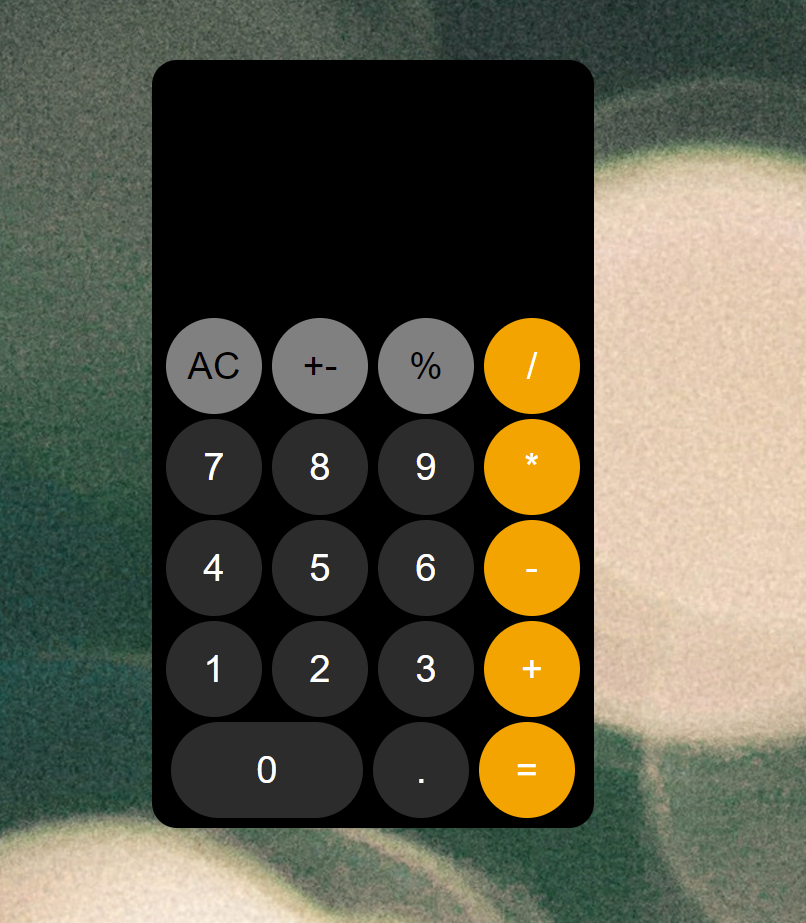
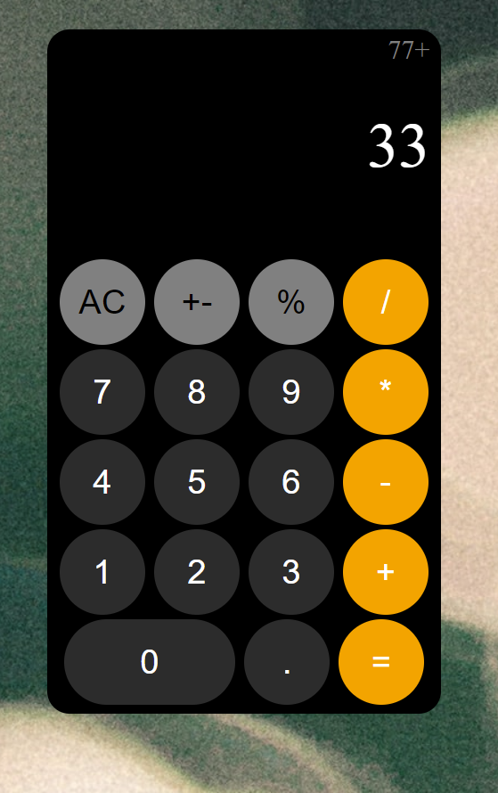

HTML, CSS, JavaScript (CSS and JavaScript play the bigger role here.)
#  :iphone: iOS-Calculator 
> This iOS Calculator app performs all calculation operations

## Table of contents
  - [Table of contents](#table-of-contents)
  - [General info](#general-info)
  - [Technologies](#technologies)
  - [How to use](#how-to-use)
  - [Screenshots](#screenshots)
  - [Contact](#contact)

## General info
This project is created to sharpen the knowledge of CSS and JS DOM Manupulations along with event listeners. It is one of the Projects from The Clarusway IT School - Projects Week.

## Technologies
* HTML
* CSS
* JavaScript

## How to use
Click on this [link](https://i-bilge.github.io/iOS-Calculator/)

## Screenshots

## Contact
:mailbox_with_mail: You can send me email : iismailbilge@gmail.com :mailbox_with_mail:
